# AXI Read-Address Proof Status

This note summarizes the current unit-level AXI master read-address proof.
The target is the read-only harness around `axi_master`.

## Lemma Structure

```mermaid
flowchart TD
    cover["Smoke reachability<br/>cover_read_request<br/>cover_read_backpressure"]

    fsm_wait["FSM wait lemma<br/>dut_requesting_read_waits_for_arready"]
    fsm_arvalid0["FSM to ARVALID<br/>dut_requesting_read_drives_arvalid"]
    fsm_arvalid1["FSM holds ARVALID<br/>dut_requesting_read_holds_arvalid"]
    arvalid_bridge["Reverse ARVALID bridge<br/>dut_arvalid_backpressure_implies_requesting_read"]

    arvalid_local["Local ARVALID property<br/>dut_arvalid_holds_until_ready"]
    arvalid_checker["Checker ARVALID property<br/>master_arvalid_held_until_ready"]

    arctrl_big["Local ARADDR/control stability<br/>dut_araddr_stable_until_ready"]
    arctrl_checker["Checker ARADDR/control stability<br/>master_araddr_stable_until_ready"]

    split_addr["Split ARADDR<br/>dut_requesting_read_holds_araddr_only"]
    split_len["Split ARLEN<br/>dut_requesting_read_holds_arlen"]
    split_burst["Split ARBURST<br/>dut_requesting_read_holds_arburst"]
    split_lock["Split ARLOCK<br/>dut_requesting_read_holds_arlock"]
    split_id["Split ARID<br/>dut_requesting_read_holds_arid"]

    addr_map["Address mapping<br/>dut_araddr_matches_addr_reg"]
    addr_reg["Internal addr register stability<br/>dut_requesting_read_holds_addr_reg"]
    addr_change_cover["Address-change debug cover<br/>cover_addr_changes_during_requesting_read_wait"]
    no_accept["No new LSU accept<br/>dut_no_lsu_accept_in_requesting_read"]
    ready_low["Ready low in request state<br/>dut_requesting_read_holds_ready_low"]

    cover --> fsm_wait
    fsm_wait --> fsm_arvalid0
    fsm_wait --> fsm_arvalid1
    fsm_wait --> arvalid_bridge
    fsm_arvalid0 --> arvalid_local
    fsm_arvalid1 --> arvalid_local
    arvalid_bridge --> arvalid_local
    arvalid_local --> arvalid_checker

    fsm_wait --> arctrl_big
    arctrl_big --> arctrl_checker

    arctrl_big --> split_addr
    arctrl_big --> split_len
    arctrl_big --> split_burst
    arctrl_big --> split_lock
    arctrl_big --> split_id

    split_addr --> addr_map
    split_addr --> addr_reg
    split_addr --> addr_change_cover
    addr_map --> split_addr
    addr_reg --> split_addr
    no_accept --> addr_reg
    ready_low --> no_accept
```



## Property Status

| Group | Property | Status | Counterexample? | Notes |
|---|---|---:|---:|---|
| Smoke cover | `cover_read_request` | covered | N/A | Covered in 2 cycles. |
| Smoke cover | `cover_read_backpressure` | covered | N/A | Covered in 4 cycles. |
| FSM lemma | `dut_requesting_read_waits_for_arready` | proven | no | DUT remains in `REQUESTING_READ` when `ARREADY=0`. |
| FSM to signal | `dut_requesting_read_drives_arvalid` | proven | no | `REQUESTING_READ` implies `ARVALID`. |
| FSM to signal | `dut_requesting_read_holds_arvalid` | proven | no | `REQUESTING_READ && !ARREADY` holds `ARVALID`. |
| FSM to signal | `dut_arvalid_backpressure_implies_requesting_read` | proven | no | Reverse bridge: `ARVALID && !ARREADY` implies `REQUESTING_READ`. |
| Local ARVALID | `dut_arvalid_holds_until_ready` | proven | no | Proves with `ENGINE_MODE=auto`; B-only timed out. |
| Local ARVALID cut | `dut_arvalid_holds_until_ready` | proven | no | Cut mode also proves with `ENGINE_MODE=auto`. |
| Local ARVALID debug | `debug_arvalid_holds_when_requesting_read` | timeout | no CE | Direct state-qualified assertion timed out under B-only at 5 minutes. |
| Local ARVALID debug | `debug_tracked_arvalid_hold` | proven | no | One-cycle tracked version proves with `ENGINE_MODE=auto`. |
| Local ARVALID debug cover | `cover_cut_violation_arvalid_drop` | timeout | no cover trace | ARVALID-drop cover was not reached within 5 minutes under B-only cut mode. |
| Checker ARVALID | `master_arvalid_held_until_ready` | proven | no | Proves without cuts using `ENGINE_MODE=auto`. |
| Local AR stability | `dut_araddr_stable_until_ready` | proven | no | Proves with `ENGINE_MODE=auto`. |
| Checker AR stability | `master_araddr_stable_until_ready` | proven | no | Proves with `ENGINE_MODE=auto`. |
| Split stability | `dut_requesting_read_holds_araddr_only` | proven | no | `ARADDR` remains stable while waiting for `ARREADY`. |
| Split stability | `dut_requesting_read_holds_arlen` | proven | no | Proved in preprocessing. |
| Split stability | `dut_requesting_read_holds_arburst` | proven | no | Proved in preprocessing. |
| Split stability | `dut_requesting_read_holds_arlock` | proven | no | Proved in preprocessing. |
| Split stability | `dut_requesting_read_holds_arid` | proven | no | Proved in preprocessing. |
| Address helper | `dut_araddr_matches_addr_reg` | proven | no | `ARADDR == {u_dut.addr, 2'b0}`. |
| Address helper | `cover_addr_changes_during_requesting_read_wait` | timeout | no cover trace | Debug cover did not find an address-change trace within 5 minutes. |
| Address helper | `dut_no_lsu_accept_in_requesting_read` | proven | no | No new LSU request is accepted in `REQUESTING_READ`. |
| Address helper | `dut_requesting_read_holds_ready_low` | proven | no | `ls_if.ready` is low in `REQUESTING_READ`. |
| Address helper | `dut_requesting_read_holds_addr_reg` | proven | no | Internal `addr` register remains stable while waiting for `ARREADY`. |

## Recent Run Metadata

| Property | Result | Time limit | Run directory | Peak memory |
|---|---:|---:|---|---:|
| `dut_arvalid_backpressure_implies_requesting_read` | proven | 5 min | `formal/runs/axi_master_read_property/20260702_002916` | 1.772 GB |
| `dut_arvalid_holds_until_ready` | timeout | 5 min | `formal/runs/axi_master_read_property/20260702_003321` | 1.742 GB |
| `dut_arvalid_holds_until_ready` with duplicate SVA cuts | timeout | 5 min | `formal/runs/axi_master_read_property/20260702_130731` | 3.395 GB |
| `debug_arvalid_holds_when_requesting_read` with duplicate SVA cuts | timeout | 5 min | `formal/runs/axi_master_read_property/20260702_132509` | 3.284 GB |
| `debug_arvalid_holds_when_requesting_read` with `assume -from_assert` cuts | timeout | 5 min | `formal/runs/axi_master_read_property/20260702_133043` | 3.232 GB |
| `cover_cut_violation_arvalid_drop` with `assume -from_assert` cuts | timeout | 5 min | `formal/runs/axi_master_read_property/20260702_133555` | 3.287 GB |
| `dut_arvalid_holds_until_ready` with `assume -from_assert` cuts | timeout | 5 min | `formal/runs/axi_master_read_property/20260702_134109` | 3.423 GB |
| `debug_tracked_arvalid_hold` with cuts, `ENGINE_MODE=auto` | proven | 5 min | `formal/runs/axi_master_read_property/20260702_143511` | 0.541 GB |
| `dut_arvalid_holds_until_ready` with cuts, `ENGINE_MODE=auto` | proven | 5 min | `formal/runs/axi_master_read_property/20260702_143525` | 0.539 GB |
| `dut_arvalid_holds_until_ready` without cuts, `ENGINE_MODE=auto` | proven | 5 min | `formal/runs/axi_master_read_property/20260702_143540` | 0.540 GB |
| `debug_tracked_arvalid_hold` with invalid explicit engine list | failed setup | N/A | `formal/runs/axi_master_read_property/20260702_143451` | 0.000 GB |
| `master_arvalid_held_until_ready` | timeout | 5 min | `formal/runs/axi_master_read_property/20260702_003827` | 1.685 GB |
| `master_arvalid_held_until_ready` without cuts, `ENGINE_MODE=auto`, engine `Hp` | proven in 0.00 s | 5 min | `formal/runs/axi_master_read_property/20260702_161823` | 0.541 GB |
| `cover_addr_changes_during_requesting_read_wait` | timeout | 5 min | `formal/runs/axi_master_read_property/20260702_004340` | 2.057 GB |
| `dut_no_lsu_accept_in_requesting_read` | timeout | 5 min | `formal/runs/axi_master_read_property/20260702_004846` | 1.470 GB |
| `dut_requesting_read_holds_ready_low` | timeout | 5 min | `formal/runs/axi_master_read_property/20260702_005352` | 1.665 GB |

## ARVALID Closure Runs

| Property | Result | Engine | Proof time | Time limit | Run directory | Peak memory |
|---|---:|---:|---:|---:|---|---:|
| `dut_requesting_read_drives_arvalid` | proven | `Bcustom1` | 34.63 s | 5 min | `formal/runs/axi_master_read_property/20260701_222238` | 1.481 GB |
| `dut_requesting_read_holds_arvalid` | proven | `Bcustom1` | 81.39 s | 5 min | `formal/runs/axi_master_read_property/20260701_222514` | 2.796 GB |
| `dut_arvalid_backpressure_implies_requesting_read` | proven | `Bcustom1` | 88.45 s | 5 min | `formal/runs/axi_master_read_property/20260702_002916` | 1.772 GB |
| `debug_tracked_arvalid_hold` with cuts | proven | `Hp` | 0.00 s | 5 min | `formal/runs/axi_master_read_property/20260702_143511` | 0.541 GB |
| `dut_arvalid_holds_until_ready` with cuts | proven | `Hp` | 0.00 s | 5 min | `formal/runs/axi_master_read_property/20260702_143525` | 0.539 GB |
| `dut_arvalid_holds_until_ready` without cuts | proven | `Hp` | 0.00 s | 5 min | `formal/runs/axi_master_read_property/20260702_143540` | 0.540 GB |
| `master_arvalid_held_until_ready` without cuts | proven | `Hp` | 0.00 s | 5 min | `formal/runs/axi_master_read_property/20260702_161823` | 0.541 GB |

## ARADDR Stability Closure Runs

| Property | Result | Engine | Proof time | Time limit | Run directory | Peak memory |
|---|---:|---:|---:|---:|---|---:|
| `dut_requesting_read_holds_addr_reg` | proven | `Hp` | 0.00 s | 5 min | `formal/runs/axi_master_read_property/20260702_165112` | 0.539 GB |
| `dut_requesting_read_holds_araddr_only` | proven | `Hp` | 0.00 s | 5 min | `formal/runs/axi_master_read_property/20260702_165129` | 0.542 GB |
| `dut_araddr_stable_until_ready` | proven | `Mpcustom2` | 0.03 s | 5 min | `formal/runs/axi_master_read_property/20260702_165141` | 0.538 GB |
| `master_araddr_stable_until_ready` | proven | `Mpcustom2` | 0.02 s | 5 min | `formal/runs/axi_master_read_property/20260702_165153` | 0.539 GB |
| `dut_requesting_read_holds_ready_low` | proven | `Hp` | 0.00 s | 5 min | `formal/runs/axi_master_read_property/20260702_165209` | 0.537 GB |
| `dut_no_lsu_accept_in_requesting_read` | proven | `Hp` | 0.00 s | 5 min | `formal/runs/axi_master_read_property/20260702_165221` | 0.537 GB |

## Current Interpretation

The read-only harness is non-vacuous, and the ARVALID path is mostly explained
by proven FSM-to-signal lemmas. The reverse bridge from
`ARVALID && !ARREADY` back to `REQUESTING_READ` also proves, but Jasper does
not automatically use independently proven assertions as assumptions for the
later ARVALID properties. A first assume-guarantee cut mode now exists behind
`USE_PROVEN_LEMMAS=1`. The Tcl log confirms that the macro is defined, the
`cut_*` assumptions are elaborated and explicitly enabled, and the two proven
ARVALID assertions are also converted with `assume -from_assert`.

The local `dut_arvalid_holds_until_ready` timeout was an engine-selection
issue, not evidence of a real counterexample or inactive cuts. With the
original B-only engine mode, Jasper timed out on the local target, the
state-qualified debug assertion, and the ARVALID-drop cover. With
`ENGINE_MODE=auto`, Jasper selected engine `Hp` and proved
`dut_arvalid_holds_until_ready` in both cut and non-cut modes. This means the
local ARVALID hold proof does not require the assume-guarantee cuts when a
suitable engine is used, although the cut-mode infrastructure is now confirmed
to compile and enable correctly.

The checker-level `master_arvalid_held_until_ready` property also proves
without cuts when run with `ENGINE_MODE=auto`. Jasper selected engine `Hp` and
proved the property in 0.00 s in
`formal/runs/axi_master_read_property/20260702_161823`. Because the no-cut
checker-level run closed, the cut-mode fallback was not needed.

The `cover_cut_violation_arvalid_drop` debug cover timed out without a cover
trace under B-only cut mode. This means Jasper did not find an ARVALID-drop
trace, but also did not prove the cover unreachable in that setup. The later
`ENGINE_MODE=auto` proof of the direct local assertion is the stronger result.

The ARADDR stability chain is now closed with `ENGINE_MODE=auto`. The RTL
reason is direct: `u_dut.addr` is assigned only in the `READY` state, where a
new LSU request is accepted and captured into `addr <= ls.addr[31:2]`.
`REQUESTING_READ` does not assign `addr`; it only updates `ARVALID` and
transitions to `WAITING_READ` when `ARREADY` is high. The harness also proves
that `ls_if.ready` is low in `REQUESTING_READ`, so no new LSU request can be
accepted during the wait state. With the internal `addr` register stable and
`ARADDR == {u_dut.addr, 2'b0}`, both the local and checker-level
ARADDR/control stability properties prove. The earlier timeouts were therefore
engine/convergence artifacts from B-only runs, not observed design
counterexamples.

## Cut Mode

Run a cut-mode proof with:

```sh
make formal-axi-master-read-property PROPERTY=dut_arvalid_holds_until_ready GUI=0 USE_PROVEN_LEMMAS=1 ENGINE_MODE=auto
```

The local property also proves without cuts when auto engine selection is used:

```sh
make formal-axi-master-read-property PROPERTY=dut_arvalid_holds_until_ready GUI=0 USE_PROVEN_LEMMAS=0 ENGINE_MODE=auto
```

The cut mode uses only independently proven local ARVALID lemmas as assumptions.
It compiles and enables the explicit `cut_*` SVA assumptions:

- `cut_arvalid_backpressure_implies_requesting_read`
- `cut_requesting_read_holds_arvalid`

It also converts the independently proven assertions into assumptions with
`assume -from_assert`:

- `dut_arvalid_backpressure_implies_requesting_read`
- `dut_requesting_read_holds_arvalid`

It does not assume the final target property
`dut_arvalid_holds_until_ready`, and it does not cut any address-stability
property.

Avoid using the B-only engine mode as the primary convergence setup for this
local ARVALID target. In the current Jasper version, B-only timed out while
`ENGINE_MODE=auto` closed the proof quickly.

## Milestone 3 Plan: AXI Read-Response Lifecycle

Milestone 3 should prove the read-response half of the same unit-level,
read-only `axi_master` harness. Milestone 2 closed the AR channel, so this
milestone starts after a legal read request and accepted AR handshake, then
checks that the DUT waits for a legal R response, consumes it, returns the read
completion to the LSU-side interface, and returns to `READY`. Because the RTL
ties `m_axi.rready = 1`, an illegal slave `RVALID` before an outstanding read
cannot be rejected by the DUT. Therefore "impossible R response" handling in
this milestone means the harness must explicitly constrain and audit the AXI
slave environment, while the DUT properties prove correct behavior under that
legal environment.

Scope:

- Stay unit-level on `axi_master`.
- Stay read-only: AR and R channels only.
- Reuse `formal/models/axi_master_read_formal_wrapper.sv`,
  `formal/interfaces/axi4_basic_props.sv`, and the
  `formal-axi-master-read-*` targets.
- Use `ENGINE_MODE=auto` by default. Keep B-only runs only as optional
  convergence comparison data.
- Do not expand to AW/W/B write channels, Wishbone, caches, or full-core
  proofs in this milestone.

### Initial Implementation Status

Implemented first Milestone 3 bring-up step:

- Added harness-local read lifecycle signals:
  `ar_accepted`, `r_accepted`, `read_pending`, and `read_completion`.
- Added `read_pending` tracking based only on observed AXI handshakes. The bit
  sets on accepted AR and clears on accepted R.
- Added `env_no_early_read_response` because `axi_master` ties
  `m_axi.rready = 1`; an early `RVALID` is an illegal slave behavior, not a DUT
  behavior that this master can reject.
- Added `env_single_beat_read_response` so the read-only harness models the
  single-beat read response implied by `ARLEN=0`.
- Added harness covers:
  `cover_read_response` and `cover_read_response_lifecycle`.
- Updated `formal-axi-master-read-smoke` to pass `ENGINE_MODE` into Jasper.

Initial run:

```sh
make formal-axi-master-read-smoke GUI=0 ENGINE_MODE=auto
```

| Target | Property | Result | Engine | Time limit | Run directory | Peak memory |
|---|---|---:|---:|---:|---|---:|
| `axi_master_read_smoke` | `cover_read_request` | covered in 2 cycles | `Hp` | 5 min | `formal/runs/axi_master_read_smoke/20260703_163106` | 0.544 GB |
| `axi_master_read_smoke` | `cover_read_backpressure` | covered in 4 cycles | `Hp` | 5 min | `formal/runs/axi_master_read_smoke/20260703_163106` | 0.544 GB |
| `axi_master_read_smoke` | `cover_read_response` | covered in 4 cycles | `Hp` | 5 min | `formal/runs/axi_master_read_smoke/20260703_163106` | 0.544 GB |
| `axi_master_read_smoke` | `cover_read_response_lifecycle` | covered in 5 cycles | `Hp` | 5 min | `formal/runs/axi_master_read_smoke/20260703_163106` | 0.544 GB |

Interpretation: the read-only unit harness is non-vacuous for the R-channel
bring-up. Jasper can reach an LSU read request, AR acceptance, a legal single
R response, and LSU-side completion/ready under the documented legal slave
environment. No write-channel, Wishbone, or full-core logic was added.

### Initial Safety Assertion Status

Implemented the first local read-response safety assertions in the read-only
harness:

- `dut_ar_accept_creates_pending_read`
- `dut_read_pending_holds_without_r_response`
- `dut_read_pending_implies_waiting_read`
- `dut_waiting_read_holds_until_rvalid`
- `dut_r_response_clears_pending_read`
- `dut_r_response_returns_to_ready`
- `dut_r_response_completes_lsu`
- `dut_read_completion_follows_r_response`
- `dut_rdata_maps_to_ls_data_out`
- `dut_rvalid_drives_ls_data_valid`
- `dut_rvalid_drives_ls_ready`

All eleven local safety lemmas prove with `ENGINE_MODE=auto`.

Progress: `[###########] 11/11` local lifecycle safety properties proven.

| Target | Property | Result | Engine | Time limit | Run directory | Peak memory |
|---|---|---:|---:|---:|---|---:|
| `axi_master_read_property` | `dut_ar_accept_creates_pending_read` | proven in 0.00 s | `Hp` | 5 min | `formal/runs/axi_master_read_property/20260702_175840` | 0.540 GB |
| `axi_master_read_property` | `dut_read_pending_holds_without_r_response` | proven in 0.00 s | `Hp` | 5 min | `formal/runs/axi_master_read_property/20260702_180558` | 0.538 GB |
| `axi_master_read_property` | `dut_read_pending_implies_waiting_read` | proven in 0.00 s | `Hp` | 5 min | `formal/runs/axi_master_read_property/20260702_232755` | 0.536 GB |
| `axi_master_read_property` | `dut_waiting_read_holds_until_rvalid` | proven in 0.01 s | `Hp` | 5 min | `formal/runs/axi_master_read_property/20260702_233110` | 0.538 GB |
| `axi_master_read_property` | `dut_r_response_clears_pending_read` | proven in 0.01 s | `Hp` | 5 min | `formal/runs/axi_master_read_property/20260702_233622` | 0.534 GB |
| `axi_master_read_property` | `dut_r_response_returns_to_ready` | proven in 0.00 s | `Hp` | 5 min | `formal/runs/axi_master_read_property/20260703_130315` | 0.540 GB |
| `axi_master_read_property` | `dut_r_response_completes_lsu` | proven in 0.00 s | `Hp` | 5 min | `formal/runs/axi_master_read_property/20260703_142410` | 0.531 GB |
| `axi_master_read_property` | `dut_read_completion_follows_r_response` | proven in 0.00 s | `Hp` | 5 min | `formal/runs/axi_master_read_property/20260703_142953` | 0.536 GB |
| `axi_master_read_property` | `dut_rdata_maps_to_ls_data_out` | proven in 0.01 s | `Hp` | 5 min | `formal/runs/axi_master_read_property/20260703_161724` | 0.534 GB |
| `axi_master_read_property` | `dut_rvalid_drives_ls_data_valid` | proven in 0.00 s | `PRE` | 5 min | `formal/runs/axi_master_read_property/20260703_162020` | 0.536 GB |
| `axi_master_read_property` | `dut_rvalid_drives_ls_ready` | proven in 0.00 s | `Hp` | 5 min | `formal/runs/axi_master_read_property/20260703_162538` | 0.544 GB |

The one-session lifecycle target is also available:

```sh
make formal-axi-master-read-lifecycle-safety GUI=0 ENGINE_MODE=auto
```

This target runs the local read-response safety ladder in
`formal/scripts/tcl/axi_master_read_lifecycle_safety.tcl`. The latest aggregate
run proved all eleven local lifecycle properties:

| Target | Result | Engine | Time limit | Run directory | Peak memory |
|---|---:|---:|---:|---|---:|
| `axi_master_read_lifecycle_safety` | 11/11 proven | `auto` (`Hp`/`PRE`) | 5 min | `formal/runs/axi_master_read_lifecycle_safety/20260703_162606` | 0.544 GB |

Checker-level read outstanding properties were closed under the same read-only
unit harness:

Progress: `[########] 8/8` read checker properties/covers passed.

```sh
make formal-axi-master-read-checker GUI=0 ENGINE_MODE=auto
```

| Target | Property | Result | Engine | Time limit | Run directory | Peak memory |
|---|---|---:|---:|---:|---|---:|
| `axi_master_read_checker` | `helper_read_count_increment` | proven in 0.00 s | `Hp` | 5 min | `formal/runs/axi_master_read_checker/20260703_163029` | 0.543 GB |
| `axi_master_read_checker` | `helper_read_count_decrement` | proven in 0.00 s | `Hp` | 5 min | `formal/runs/axi_master_read_checker/20260703_163029` | 0.543 GB |
| `axi_master_read_checker` | `helper_read_count_stable` | proven in 0.00 s | `Hp` | 5 min | `formal/runs/axi_master_read_checker/20260703_163029` | 0.543 GB |
| `axi_master_read_checker` | `master_read_outstanding_limit` | proven in 0.02 s | `Hp` | 5 min | `formal/runs/axi_master_read_checker/20260703_163029` | 0.543 GB |
| `axi_master_read_checker` | `master_no_second_read_accept` | proven in 0.01 s | `Hp` | 5 min | `formal/runs/axi_master_read_checker/20260703_163029` | 0.543 GB |
| `axi_master_read_checker` | `cover_read_request` | covered in 3 cycles | `Hp` | 5 min | `formal/runs/axi_master_read_checker/20260703_163029` | 0.543 GB |
| `axi_master_read_checker` | `cover_read_response` | covered in 4 cycles | `Hp` | 5 min | `formal/runs/axi_master_read_checker/20260703_163029` | 0.543 GB |
| `axi_master_read_checker` | `cover_read_outstanding_lifecycle` | covered in 6 cycles | `Hp` | 5 min | `formal/runs/axi_master_read_checker/20260703_163029` | 0.543 GB |

The cover trace for the full DUT lifecycle is available in the Jasper run
`formal/runs/axi_master_read_smoke/20260703_163106`. Use
`cover_read_response_lifecycle` for the report screenshot.

### Deliverable Status

- Done: tightened read-response harness section with explicit legal R-channel
  assumptions.
- Done: full lifecycle cover from LSU read request to AR handshake to accepted
  R response to LSU completion.
- Done: local DUT lemmas proving the `WAITING_READ` read-response behavior.
- Done: checker-level read outstanding and read lifecycle properties closed in
  the unit-level read harness.
- Done: run metadata table with target, property, result, engine, time limit,
  run directory, and peak memory.
- Done: written assumption audit separating DUT obligations from legal AXI
  slave environment constraints.
- Report artifact: capture one GUI waveform screenshot from
  `cover_read_response_lifecycle` in
  `formal/runs/axi_master_read_smoke/20260703_163106`.

### Assumption Classification

Reset and warmup assumptions:

- `formal_active` masks the first post-reset cycle so stale uninitialized state
  is not interpreted as real protocol behavior.
- `env_quiet_during_warmup` keeps LSU requests and R responses quiet before the
  harness is active.
- These assumptions are proof setup, not DUT behavior.

LSU request protocol assumptions:

- `env_legal_read_request`: `ls_new_request` is issued only when `ls_if.ready`
  is high.
- `env_read_request_is_a_pulse`: a read request is a one-cycle command.
- The harness keeps `ls_if.re=1`, `ls_if.we=0`, and `amo=0` to isolate normal
  non-AMO reads.
- These assumptions model the upstream LSU-side requester. They must not assume
  the DUT's response or completion behavior.

AXI slave environment assumptions:

- R responses may occur only after a read is outstanding. This is already
  represented in the checker by `env_no_rresponse_if_no_os`.
- R responses must use the ID of the accepted AR transaction. This is already
  represented by `env_arid_match_rid`.
- For this single-beat harness, an accepted R response should be legal only for
  the single accepted read. If `RLAST` is included in the milestone, require it
  to be high with the accepted R beat.
- No bounded eventual `RVALID` assumption should be used for safety proofs. A
  bounded response assumption may be used only for cover/debug targets and must
  be documented as such.

Debug and proof-control assumptions:

- `BOUND_ARREADY_FOR_COVER` is cover-only and should remain disabled for safety
  proofs.
- Any future `BOUND_RVALID_FOR_COVER` should follow the same pattern: cover-only,
  disabled for final safety proofs.
- Assume-guarantee cuts may be used only after the cut lemma has first been
  proven independently under the same assumptions. Do not assume the final
  target property itself.

### Planned Properties

| Property | Intent | Expected difficulty | Required assumptions | Run metadata fields |
|---|---|---:|---|---|
| `cover_read_request` | Reconfirm non-vacuous LSU read request entry. | low | reset/warmup, LSU protocol | target, result, engine, time limit, run dir, peak memory |
| `cover_read_backpressure` | Reconfirm AR handshake reachability with backpressure. | low | reset/warmup, LSU protocol, cover-only ARREADY bound | target, result, engine, time limit, run dir, peak memory |
| `cover_read_response_lifecycle` | Cover LSU request -> AR accept -> R accept -> LSU completion. | medium | reset/warmup, LSU protocol, AXI slave legality, optional cover-only RVALID bound | target, result, engine, time limit, run dir, peak memory |
| `dut_ar_accept_enters_waiting_read` | Accepted AR handshake moves DUT into `WAITING_READ`. | low | reset/warmup, LSU protocol | target, result, engine, time limit, run dir, peak memory |
| `dut_ar_accept_creates_pending_read` | A local tracked pending-read bit becomes set after accepted AR. | medium | reset/warmup, LSU protocol, AXI slave legality | target, result, engine, time limit, run dir, peak memory |
| `dut_waiting_read_holds_until_rvalid` | DUT stays in `WAITING_READ` while no legal R response is present. | medium | reset/warmup, AXI slave legality | target, result, engine, time limit, run dir, peak memory |
| `dut_no_completion_without_pending_read` | `ls_if.data_valid` and read completion do not occur before an outstanding read exists. | medium | reset/warmup, LSU protocol, AXI slave legality | target, result, engine, time limit, run dir, peak memory |
| `dut_r_response_clears_pending_read` | Accepted legal R response clears the local pending-read tracker. | medium | reset/warmup, AXI slave legality | target, result, engine, time limit, run dir, peak memory |
| `dut_r_response_returns_to_ready` | Non-AMO read response moves DUT from `WAITING_READ` back to `READY`. | low | reset/warmup, AXI slave legality | target, result, engine, time limit, run dir, peak memory |
| `dut_rdata_maps_to_ls_data_out` | Accepted R response maps `axi_if.rdata` to `ls_if.data_out`. | medium | reset/warmup, AXI slave legality | target, result, engine, time limit, run dir, peak memory |
| `dut_rvalid_drives_ls_data_valid` | Legal R response produces LSU `data_valid`. | medium | reset/warmup, AXI slave legality | target, result, engine, time limit, run dir, peak memory |
| `dut_rvalid_drives_ls_ready` | Legal non-AMO read response produces LSU `ready`. | medium | reset/warmup, AXI slave legality | target, result, engine, time limit, run dir, peak memory |
| `env_no_rresponse_if_no_os` | Audit that the harness forbids accepted R responses when no read is outstanding. | low | checker reset assumptions | target, result, engine, time limit, run dir, peak memory |
| `helper_read_count_increment` | Checker outstanding count increments on AR accept without R accept. | low | checker reset assumptions | target, result, engine, time limit, run dir, peak memory |
| `helper_read_count_decrement` | Checker outstanding count decrements on R accept without AR accept. | low | checker AXI slave legality | target, result, engine, time limit, run dir, peak memory |
| `helper_read_count_stable` | Checker outstanding count is stable when AR and R acceptance match. | low | checker reset assumptions | target, result, engine, time limit, run dir, peak memory |
| `master_read_outstanding_limit` | Checker-level proof that read outstanding count never exceeds one. | medium | reset/warmup, LSU protocol, AXI slave legality | target, result, engine, time limit, run dir, peak memory |
| `master_no_second_read_accept` | Checker-level proof that a second read is not accepted while one is outstanding. | medium | reset/warmup, LSU protocol, AXI slave legality | target, result, engine, time limit, run dir, peak memory |
| `cover_read_outstanding_lifecycle` | Checker cover for AR accept -> outstanding count set -> R accept -> count clear. | medium | reset/warmup, AXI slave legality, optional cover-only RVALID bound | target, result, engine, time limit, run dir, peak memory |

The planned names above may be adjusted during implementation to match the
final SVA structure. Keep the names explicit enough that the Jasper property
table explains the proof ladder without opening the source file.

### Proof Ladder

1. Re-run the Milestone 2 smoke covers with `ENGINE_MODE=auto` to confirm the
   baseline harness still reaches LSU read requests and AR handshakes.
2. Add and cover the full read lifecycle:
   `ls_new_request` -> `ARVALID && ARREADY` -> `RVALID && RREADY` ->
   `ls_if.data_valid`/completion.
3. Add a small harness-local pending-read tracker. It should set on accepted AR
   and clear on accepted R. This tracker is a proof aid, not a replacement for
   the DUT state.
4. Prove AR accept creates pending state:
   `ARVALID && ARREADY |=> pending_read`.
5. Prove state bridge lemmas:
   accepted AR enters `WAITING_READ`; while in `WAITING_READ` and no legal
   `RVALID`, the DUT remains in `WAITING_READ`.
6. Prove no completion happens before a pending read exists. This prevents
   false proofs where an unconstrained R response creates LSU completion before
   the DUT has issued a read.
7. Audit the illegal-response environment assumption. Do not claim the DUT
   rejects illegal R beats; with `m_axi.rready = 1`, the proof obligation is
   that final DUT properties are run only under a documented legal AXI slave
   environment.
8. Prove accepted R response behavior in small pieces:
   pending clears, state returns to `READY`, `ls_if.data_out == axi_if.rdata`,
   `ls_if.data_valid` asserts, and `ls_if.ready` asserts for the non-AMO read
   case.
9. Close checker-level outstanding properties:
   `master_read_outstanding_limit`, `master_no_second_read_accept`, and the
   read lifecycle covers in `axi4_basic_props`.
10. Record run metadata and one cover waveform screenshot for the full lifecycle
   trace.

### Exit Criteria Status

- Done: the read-response lifecycle cover is covered in 5 cycles in
  `formal/runs/axi_master_read_smoke/20260703_163106`.
- Done: the local pending-read/state/data/ready lemmas are proven with
  `ENGINE_MODE=auto`.
- Done: checker-level read outstanding limit, no-second-read-accept, helper
  count properties, and checker read lifecycle covers pass in the unit-level
  read harness.
- Done: the assumption audit separates reset/warmup, LSU requester protocol,
  AXI slave environment, and debug/proof-control assumptions.
- Done: safety proofs do not rely on bounded eventual `ARREADY` or bounded
  eventual `RVALID`; the ARREADY bound is limited to the cover wrapper.
- Done: the status table records target, property, result, engine, time limit,
  run directory, and peak memory for every reported proof and cover.
- Report artifact: capture a GUI screenshot from
  `cover_read_response_lifecycle` in
  `formal/runs/axi_master_read_smoke/20260703_163106` if the final report needs
  an image.

### Implementation Notes For Review

- `formal-axi-master-read-property` now routes harness-local properties and
  checker properties explicitly, so read checker helper properties can be
  proven in the unit-level read harness.
- The existing RTL assigns `m_axi.rready = 1`, so an AXI R beat is accepted
  whenever `axi_if.rvalid` is high. The environment must prevent impossible R
  beats before an accepted AR; the DUT cannot enforce that on a master input.
- In `WAITING_READ`, the non-AMO behavior is direct: `ls.ready <= m_axi.rvalid`,
  `ls.data_out <= m_axi.rdata`, `ls.data_valid <= m_axi.rvalid`, and the state
  returns to `READY` when `m_axi.rvalid` is high. These direct assignments are
  good candidates for the first local lemmas.
