# AXI Read-Address Proof Status

This note summarizes the current unit-level AXI master read-address proof.
The target is the read-only harness around `axi_master`.

## Lemma Structure

```mermaid
flowchart TD
    cover["Smoke reachability<br/>cover_read_request<br/>cover_read_backpressure"]

    fsm_wait["FSM wait lemma<br/>dut_requesting_read_waits_for_arready"]
    fsm_arvalid0["FSM to ARVALID<br/>dut_requesting_read_drives_arvalid"]
    fsm_arvalid1["FSM holds ARVALID<br/>dut_requesting_read_holds_arvalid"]
    arvalid_bridge["Reverse ARVALID bridge<br/>dut_arvalid_backpressure_implies_requesting_read"]

    arvalid_local["Local ARVALID property<br/>dut_arvalid_holds_until_ready"]
    arvalid_checker["Checker ARVALID property<br/>master_arvalid_held_until_ready"]

    arctrl_big["Local ARADDR/control stability<br/>dut_araddr_stable_until_ready"]
    arctrl_checker["Checker ARADDR/control stability<br/>master_araddr_stable_until_ready"]

    split_addr["Split ARADDR<br/>dut_requesting_read_holds_araddr_only"]
    split_len["Split ARLEN<br/>dut_requesting_read_holds_arlen"]
    split_burst["Split ARBURST<br/>dut_requesting_read_holds_arburst"]
    split_lock["Split ARLOCK<br/>dut_requesting_read_holds_arlock"]
    split_id["Split ARID<br/>dut_requesting_read_holds_arid"]

    addr_map["Address mapping<br/>dut_araddr_matches_addr_reg"]
    addr_reg["Internal addr register stability<br/>dut_requesting_read_holds_addr_reg"]
    addr_change_cover["Address-change debug cover<br/>cover_addr_changes_during_requesting_read_wait"]
    no_accept["No new LSU accept<br/>dut_no_lsu_accept_in_requesting_read"]
    ready_low["Ready low in request state<br/>dut_requesting_read_holds_ready_low"]

    cover --> fsm_wait
    fsm_wait --> fsm_arvalid0
    fsm_wait --> fsm_arvalid1
    fsm_wait --> arvalid_bridge
    fsm_arvalid0 --> arvalid_local
    fsm_arvalid1 --> arvalid_local
    arvalid_bridge --> arvalid_local
    arvalid_local --> arvalid_checker

    fsm_wait --> arctrl_big
    arctrl_big --> arctrl_checker

    arctrl_big --> split_addr
    arctrl_big --> split_len
    arctrl_big --> split_burst
    arctrl_big --> split_lock
    arctrl_big --> split_id

    split_addr --> addr_map
    split_addr --> addr_reg
    split_addr --> addr_change_cover
    addr_map --> split_addr
    addr_reg --> split_addr
    no_accept --> addr_reg
    ready_low --> no_accept
```



## Property Status

| Group | Property | Status | Counterexample? | Notes |
|---|---|---:|---:|---|
| Smoke cover | `cover_read_request` | covered | N/A | Covered in 2 cycles. |
| Smoke cover | `cover_read_backpressure` | covered | N/A | Covered in 4 cycles. |
| FSM lemma | `dut_requesting_read_waits_for_arready` | proven | no | DUT remains in `REQUESTING_READ` when `ARREADY=0`. |
| FSM to signal | `dut_requesting_read_drives_arvalid` | proven | no | `REQUESTING_READ` implies `ARVALID`. |
| FSM to signal | `dut_requesting_read_holds_arvalid` | proven | no | `REQUESTING_READ && !ARREADY` holds `ARVALID`. |
| FSM to signal | `dut_arvalid_backpressure_implies_requesting_read` | proven | no | Reverse bridge: `ARVALID && !ARREADY` implies `REQUESTING_READ`. |
| Local ARVALID | `dut_arvalid_holds_until_ready` | proven | no | Proves with `ENGINE_MODE=auto`; B-only timed out. |
| Local ARVALID cut | `dut_arvalid_holds_until_ready` | proven | no | Cut mode also proves with `ENGINE_MODE=auto`. |
| Local ARVALID debug | `debug_arvalid_holds_when_requesting_read` | timeout | no CE | Direct state-qualified assertion timed out under B-only at 5 minutes. |
| Local ARVALID debug | `debug_tracked_arvalid_hold` | proven | no | One-cycle tracked version proves with `ENGINE_MODE=auto`. |
| Local ARVALID debug cover | `cover_cut_violation_arvalid_drop` | timeout | no cover trace | ARVALID-drop cover was not reached within 5 minutes under B-only cut mode. |
| Checker ARVALID | `master_arvalid_held_until_ready` | proven | no | Proves without cuts using `ENGINE_MODE=auto`. |
| Local AR stability | `dut_araddr_stable_until_ready` | proven | no | Proves with `ENGINE_MODE=auto`. |
| Checker AR stability | `master_araddr_stable_until_ready` | proven | no | Proves with `ENGINE_MODE=auto`. |
| Split stability | `dut_requesting_read_holds_araddr_only` | proven | no | `ARADDR` remains stable while waiting for `ARREADY`. |
| Split stability | `dut_requesting_read_holds_arlen` | proven | no | Proved in preprocessing. |
| Split stability | `dut_requesting_read_holds_arburst` | proven | no | Proved in preprocessing. |
| Split stability | `dut_requesting_read_holds_arlock` | proven | no | Proved in preprocessing. |
| Split stability | `dut_requesting_read_holds_arid` | proven | no | Proved in preprocessing. |
| Address helper | `dut_araddr_matches_addr_reg` | proven | no | `ARADDR == {u_dut.addr, 2'b0}`. |
| Address helper | `cover_addr_changes_during_requesting_read_wait` | timeout | no cover trace | Debug cover did not find an address-change trace within 5 minutes. |
| Address helper | `dut_no_lsu_accept_in_requesting_read` | proven | no | No new LSU request is accepted in `REQUESTING_READ`. |
| Address helper | `dut_requesting_read_holds_ready_low` | proven | no | `ls_if.ready` is low in `REQUESTING_READ`. |
| Address helper | `dut_requesting_read_holds_addr_reg` | proven | no | Internal `addr` register remains stable while waiting for `ARREADY`. |

## Recent Run Metadata

| Property | Result | Time limit | Run directory | Peak memory |
|---|---:|---:|---|---:|
| `dut_arvalid_backpressure_implies_requesting_read` | proven | 5 min | `formal/runs/axi_master_read_property/20260702_002916` | 1.772 GB |
| `dut_arvalid_holds_until_ready` | timeout | 5 min | `formal/runs/axi_master_read_property/20260702_003321` | 1.742 GB |
| `dut_arvalid_holds_until_ready` with duplicate SVA cuts | timeout | 5 min | `formal/runs/axi_master_read_property/20260702_130731` | 3.395 GB |
| `debug_arvalid_holds_when_requesting_read` with duplicate SVA cuts | timeout | 5 min | `formal/runs/axi_master_read_property/20260702_132509` | 3.284 GB |
| `debug_arvalid_holds_when_requesting_read` with `assume -from_assert` cuts | timeout | 5 min | `formal/runs/axi_master_read_property/20260702_133043` | 3.232 GB |
| `cover_cut_violation_arvalid_drop` with `assume -from_assert` cuts | timeout | 5 min | `formal/runs/axi_master_read_property/20260702_133555` | 3.287 GB |
| `dut_arvalid_holds_until_ready` with `assume -from_assert` cuts | timeout | 5 min | `formal/runs/axi_master_read_property/20260702_134109` | 3.423 GB |
| `debug_tracked_arvalid_hold` with cuts, `ENGINE_MODE=auto` | proven | 5 min | `formal/runs/axi_master_read_property/20260702_143511` | 0.541 GB |
| `dut_arvalid_holds_until_ready` with cuts, `ENGINE_MODE=auto` | proven | 5 min | `formal/runs/axi_master_read_property/20260702_143525` | 0.539 GB |
| `dut_arvalid_holds_until_ready` without cuts, `ENGINE_MODE=auto` | proven | 5 min | `formal/runs/axi_master_read_property/20260702_143540` | 0.540 GB |
| `debug_tracked_arvalid_hold` with invalid explicit engine list | failed setup | N/A | `formal/runs/axi_master_read_property/20260702_143451` | 0.000 GB |
| `master_arvalid_held_until_ready` | timeout | 5 min | `formal/runs/axi_master_read_property/20260702_003827` | 1.685 GB |
| `master_arvalid_held_until_ready` without cuts, `ENGINE_MODE=auto`, engine `Hp` | proven in 0.00 s | 5 min | `formal/runs/axi_master_read_property/20260702_161823` | 0.541 GB |
| `cover_addr_changes_during_requesting_read_wait` | timeout | 5 min | `formal/runs/axi_master_read_property/20260702_004340` | 2.057 GB |
| `dut_no_lsu_accept_in_requesting_read` | timeout | 5 min | `formal/runs/axi_master_read_property/20260702_004846` | 1.470 GB |
| `dut_requesting_read_holds_ready_low` | timeout | 5 min | `formal/runs/axi_master_read_property/20260702_005352` | 1.665 GB |

## ARVALID Closure Runs

| Property | Result | Engine | Proof time | Time limit | Run directory | Peak memory |
|---|---:|---:|---:|---:|---|---:|
| `dut_requesting_read_drives_arvalid` | proven | `Bcustom1` | 34.63 s | 5 min | `formal/runs/axi_master_read_property/20260701_222238` | 1.481 GB |
| `dut_requesting_read_holds_arvalid` | proven | `Bcustom1` | 81.39 s | 5 min | `formal/runs/axi_master_read_property/20260701_222514` | 2.796 GB |
| `dut_arvalid_backpressure_implies_requesting_read` | proven | `Bcustom1` | 88.45 s | 5 min | `formal/runs/axi_master_read_property/20260702_002916` | 1.772 GB |
| `debug_tracked_arvalid_hold` with cuts | proven | `Hp` | 0.00 s | 5 min | `formal/runs/axi_master_read_property/20260702_143511` | 0.541 GB |
| `dut_arvalid_holds_until_ready` with cuts | proven | `Hp` | 0.00 s | 5 min | `formal/runs/axi_master_read_property/20260702_143525` | 0.539 GB |
| `dut_arvalid_holds_until_ready` without cuts | proven | `Hp` | 0.00 s | 5 min | `formal/runs/axi_master_read_property/20260702_143540` | 0.540 GB |
| `master_arvalid_held_until_ready` without cuts | proven | `Hp` | 0.00 s | 5 min | `formal/runs/axi_master_read_property/20260702_161823` | 0.541 GB |

## ARADDR Stability Closure Runs

| Property | Result | Engine | Proof time | Time limit | Run directory | Peak memory |
|---|---:|---:|---:|---:|---|---:|
| `dut_requesting_read_holds_addr_reg` | proven | `Hp` | 0.00 s | 5 min | `formal/runs/axi_master_read_property/20260702_165112` | 0.539 GB |
| `dut_requesting_read_holds_araddr_only` | proven | `Hp` | 0.00 s | 5 min | `formal/runs/axi_master_read_property/20260702_165129` | 0.542 GB |
| `dut_araddr_stable_until_ready` | proven | `Mpcustom2` | 0.03 s | 5 min | `formal/runs/axi_master_read_property/20260702_165141` | 0.538 GB |
| `master_araddr_stable_until_ready` | proven | `Mpcustom2` | 0.02 s | 5 min | `formal/runs/axi_master_read_property/20260702_165153` | 0.539 GB |
| `dut_requesting_read_holds_ready_low` | proven | `Hp` | 0.00 s | 5 min | `formal/runs/axi_master_read_property/20260702_165209` | 0.537 GB |
| `dut_no_lsu_accept_in_requesting_read` | proven | `Hp` | 0.00 s | 5 min | `formal/runs/axi_master_read_property/20260702_165221` | 0.537 GB |

## Current Interpretation

The read-only harness is non-vacuous, and the ARVALID path is mostly explained
by proven FSM-to-signal lemmas. The reverse bridge from
`ARVALID && !ARREADY` back to `REQUESTING_READ` also proves, but Jasper does
not automatically use independently proven assertions as assumptions for the
later ARVALID properties. A first assume-guarantee cut mode now exists behind
`USE_PROVEN_LEMMAS=1`. The Tcl log confirms that the macro is defined, the
`cut_*` assumptions are elaborated and explicitly enabled, and the two proven
ARVALID assertions are also converted with `assume -from_assert`.

The local `dut_arvalid_holds_until_ready` timeout was an engine-selection
issue, not evidence of a real counterexample or inactive cuts. With the
original B-only engine mode, Jasper timed out on the local target, the
state-qualified debug assertion, and the ARVALID-drop cover. With
`ENGINE_MODE=auto`, Jasper selected engine `Hp` and proved
`dut_arvalid_holds_until_ready` in both cut and non-cut modes. This means the
local ARVALID hold proof does not require the assume-guarantee cuts when a
suitable engine is used, although the cut-mode infrastructure is now confirmed
to compile and enable correctly.

The checker-level `master_arvalid_held_until_ready` property also proves
without cuts when run with `ENGINE_MODE=auto`. Jasper selected engine `Hp` and
proved the property in 0.00 s in
`formal/runs/axi_master_read_property/20260702_161823`. Because the no-cut
checker-level run closed, the cut-mode fallback was not needed.

The `cover_cut_violation_arvalid_drop` debug cover timed out without a cover
trace under B-only cut mode. This means Jasper did not find an ARVALID-drop
trace, but also did not prove the cover unreachable in that setup. The later
`ENGINE_MODE=auto` proof of the direct local assertion is the stronger result.

The ARADDR stability chain is now closed with `ENGINE_MODE=auto`. The RTL
reason is direct: `u_dut.addr` is assigned only in the `READY` state, where a
new LSU request is accepted and captured into `addr <= ls.addr[31:2]`.
`REQUESTING_READ` does not assign `addr`; it only updates `ARVALID` and
transitions to `WAITING_READ` when `ARREADY` is high. The harness also proves
that `ls_if.ready` is low in `REQUESTING_READ`, so no new LSU request can be
accepted during the wait state. With the internal `addr` register stable and
`ARADDR == {u_dut.addr, 2'b0}`, both the local and checker-level
ARADDR/control stability properties prove. The earlier timeouts were therefore
engine/convergence artifacts from B-only runs, not observed design
counterexamples.

## Cut Mode

Run a cut-mode proof with:

```sh
make formal-axi-master-read-property PROPERTY=dut_arvalid_holds_until_ready GUI=0 USE_PROVEN_LEMMAS=1 ENGINE_MODE=auto
```

The local property also proves without cuts when auto engine selection is used:

```sh
make formal-axi-master-read-property PROPERTY=dut_arvalid_holds_until_ready GUI=0 USE_PROVEN_LEMMAS=0 ENGINE_MODE=auto
```

The cut mode uses only independently proven local ARVALID lemmas as assumptions.
It compiles and enables the explicit `cut_*` SVA assumptions:

- `cut_arvalid_backpressure_implies_requesting_read`
- `cut_requesting_read_holds_arvalid`

It also converts the independently proven assertions into assumptions with
`assume -from_assert`:

- `dut_arvalid_backpressure_implies_requesting_read`
- `dut_requesting_read_holds_arvalid`

It does not assume the final target property
`dut_arvalid_holds_until_ready`, and it does not cut any address-stability
property.

Avoid using the B-only engine mode as the primary convergence setup for this
local ARVALID target. In the current Jasper version, B-only timed out while
`ENGINE_MODE=auto` closed the proof quickly.

## Next Target

The next narrow target is the AXI read-response lifecycle and outstanding-count
proof in the same read-only `axi_master` harness. Stay on the AR/R read side;
do not expand to AW/W/B, Wishbone, or full-core proofs for this step.

Initial proof intent:

- An accepted AR handshake creates exactly one outstanding read transaction.
- A legal accepted R response clears the outstanding read transaction.
- The environment does not provide an accepted R response when no read is
  outstanding.
- A read lifecycle cover reaches an AR handshake followed by an accepted R
  response.

Candidate checker/helper properties:

- `helper_read_count_increment`
- `helper_read_count_decrement`
- `helper_read_count_stable`
- `master_read_outstanding_limit`
- `master_no_second_read_accept`
- `env_no_rresponse_if_no_os` as an environment-assumption audit, not a DUT
  guarantee.

Candidate harness work:

- Add a read-lifecycle cover that reaches `ARVALID && ARREADY`, then later
  `RVALID && RREADY`.
- Keep legal R-response behavior as an environment assumption.
- Use `ENGINE_MODE=auto` by default and record run directory, result, engine,
  time limit, and peak memory for each run.
